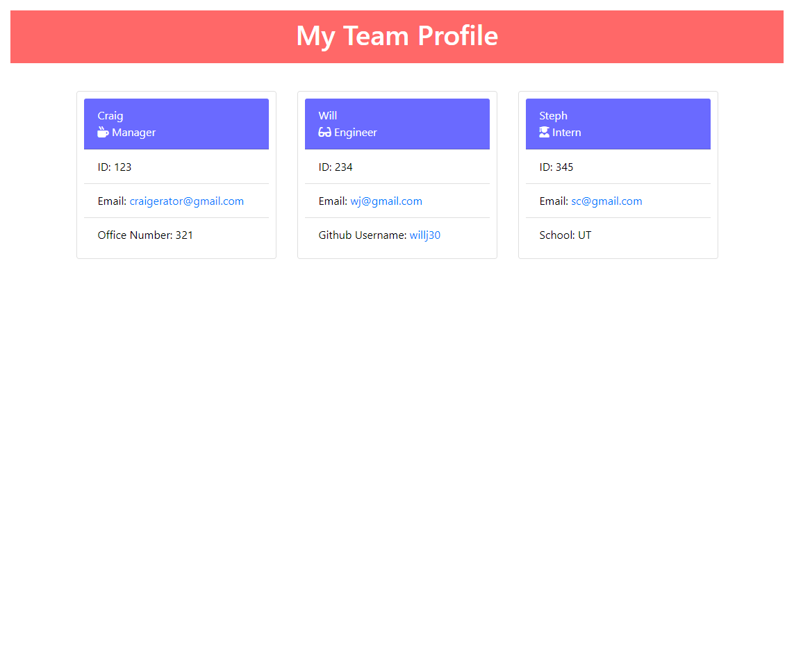
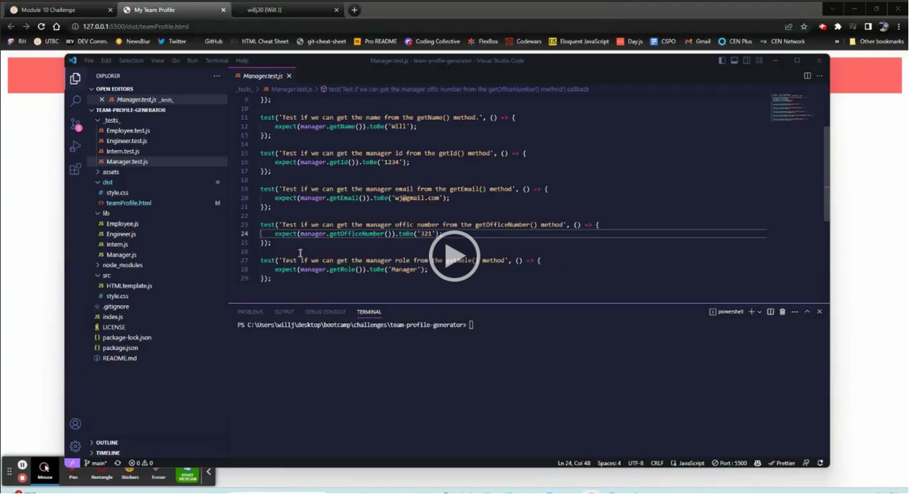

# team-profile-generator
  
  
 

  ## Description
  With this application you will be able to create a team profile with manager, engineer, and intern roles using the command line. You will also have the ability to test the methods used for retreiving different information within the generated objects.
  
  ## Table of Contents
  * [Description](#description)
  * [Installation](#installation)
  * [Usage](#usage)
  * [License](#license)
  * [Contribution](#contribution)
  * [Tests](#tests)
  * [Questions](#questions)
  

  ## Installation
  For this application to work, you will need to clone it then run npm install.
  
  ## Usage
  In the command line interface, run node index.js and follow the prompts to create your team profile. This will generate a teamProfile.html in the dist file that you can then view in your browswer.

  Screenshot:

Demonstration:

 

  ## License
  The license this project is under is MIT. For more information, please click the link below:

  https://opensource.org/licenses/MIT
  
  ## Contribution
  Feel free to reach out to me on GitHub.
  
  ## Tests
  Once you've cloned the repo and run npm install, you can then run npm test to validate the methods.
  
  ## Questions
  Any Questions? You can email me at willjaramillo30@gmail.com
  Or, reach out to me on GitHub at https://github/willj30
